# Java Basic

## 01-helloworld

### hello.java

```java
public class hello{
	
	public static void main(String[]args){
		
		System.out.println("HelloWorld");
		
	}	
}


```

### Output


## 02-data-types

### test.java

```java
public class test{
	
	public static void main(String[]args){
		
		
		short x=6;
		int y=12;
		float a=12.5f;
		String b="Hello";
		
	
	   System.out.println("The Short x is "+x);
	   System.out.println("The int y is "+y);
	   System.out.println("The float a is" +a);
	   System.out.println("The String b is" +b);
		
	}
}

//In java we need to  decalre the data type of a variable before we use it.
//   Integer values
//   --------------
//   byte    8bits
//   short   16bits
//   int     32bits
//   long    64bits

//   Float Values
//   -------------
//   float   32bits
//   double  64bits 

//   string for text values.
//   char is used to store only one charator.
//   boolen is true or false.


```

### Output


## 03-arithmetic

### arithmetic.java

```java
public class arithmetic{
	
	public static void main(String[]args){
		
		short x=6;
		int y=4;
		float a=12.5f;
		float b=7f;
		
		System.out.println("x+y "+(x+y));
		System.out.println("x-y"+(x-y));
		System.out.println("x*y"+(x*y));
		System.out.println("x%y"+(x%y));
	    System.out.println("a/b"+(a/b));
		
	}
	
}

// + addition
// - subtraction
// / divition
// % moudels
// * multiplication


```


### Output


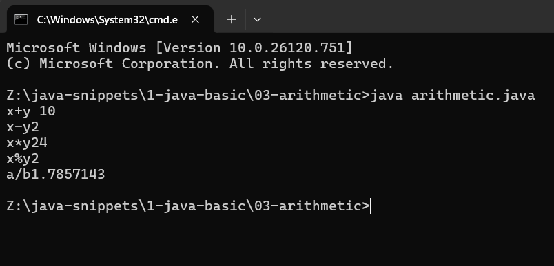

## 04-assinment-operators

### hello.java

```java

  Assignment Operators
  --------------------

  x+=y    x = x + y
  x-=y    x = x - y
  x*=y    x = x * y
  x/=y    x = x / y

```

### Output


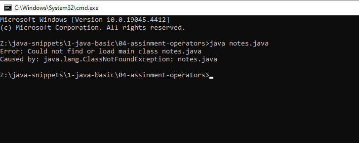


## 05-increment-or-decrement

### inc.java

```java
public class inc{
	
	public static void main(String[]args){
		
		int x=0;
		int y=0;
		x++;
		System.out.println(x);//the values would be 1
		System.out.println(++y);//the values would be 1
		
		
	}
}

```

### Output


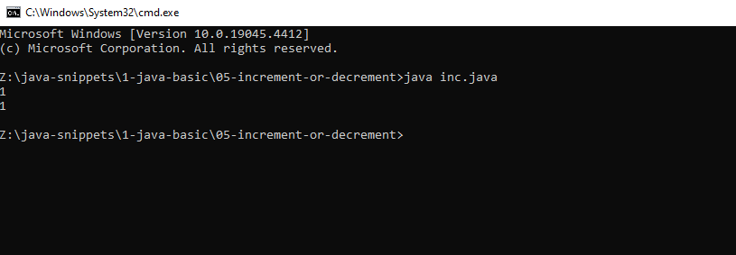

## 06-comparisons

### inc.java

```java
 Comparisons
 -----------
  ==
  !=
  <
  > 
  <=
  >=


```

## 07-if-statement

### ifState.java

```java
public class ifState{
	
	public static void main(String[]args){
		
		int x=5;
		int y=4;
		
		if(x<y){
			
			System.out.println("X is less than Y");
			
		}else {
			
			System.out.println("Y is greater than x");
			
		}
		
	}
	
}

```

### Output


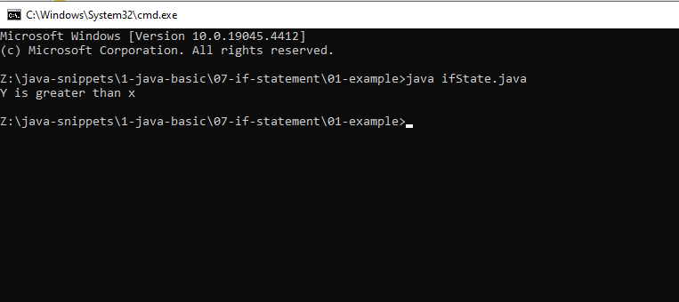


### weatherCondition.java

```java
public class weatherCondition{
	
	public static void main(String[]args){
		
		int month=10;
		
		String det;
		
		if(month==12||month==1||month==2){
			
			det="Winter";
			
		}else if(month==3||month==4||month==5){
			
			det="Spring";
			
		}else if(month==6||month==7||month==8){
			
			det="Summer";
			
		}else if(month==9||month==10||month==11){
			
			det="Autumn";
			
		}else{
			
			det="Invalid Number";
			
		}
		
		System.out.println(det);
		
	}
	
	
}

//This programme is written to calculate the weather condition.
//or || is used to check if any of them or if all of them true it will return true.
//if all of them is false it will return false.

```


### Output


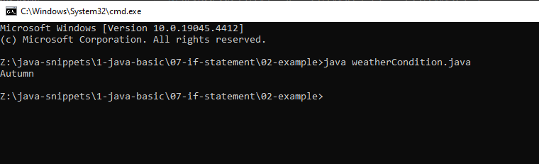

## 08-switch-statement

### switchSte.java

```java
public class switchSte{
	
	
	String converNum(int val){
		
		switch(val){
			
			case 0:
			return "Zero";
			
			case 1:
			return "one";
			
			case 2:
			return "two";
			
			case 3:
			return "Three";
			
			case 4:
			return "Four";
			
			case 5:
			return "Five";
			
			case 6:
			return "Six";
			
			case 7:
			return "Seven";
			
			case 8:
			return "Eight";
			
			case 9:
			return "Nine";
			
			case 10:
			return "Ten";
			
			default:
			return "invalid Number";
			
			
		}
		
	}
	
	public static void main(String[]args){
		
		
	switchSte n=new switchSte();
	String num=n.converNum(55);
	System.out.println(num);
		
		
	}
	
}

```

### Output


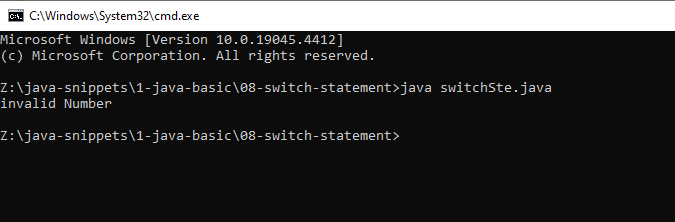

## 09-forloop

### foorloop.java

```java
class foorloop{
	
	public static void main(String[]args){
		
		int a;
		
		for(a=0;a<=10;a++){
			
			System.out.println(a);
			
		}
		
	}
	
}


//This is a simple foor loopin java

```


### Output


### forLoop.java

```java
class forLoop{
	
	public static void main(String[]args){
		
		int c;
		
		for(c=0;c<=10;c=c+1){
			
			if(c==5){
				
				System.out.println("Five was Found "+c);
				
			}else{
				
				System.out.println(c);
				
			}
			
		}
		
		
	}
	
	
}

//i have used if condition inside a for loop

```


### Output


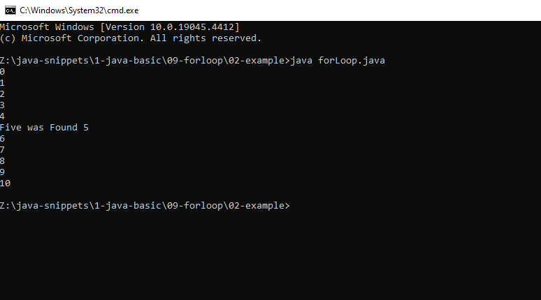

### forLoop.java

```java
public class forLoop{
	
	public static void main(String[]args){
		
		int d;
		
		for(d=10;d>0;d=d-1){
			
			if(d==5){
				
				System.out.println("Five was found");
				
			}else {
				
				System.out.println(d);
				
			}
			
		}
		
	}
	
}

//this for loop counts number from 10 to 0 reversely

```


### Output


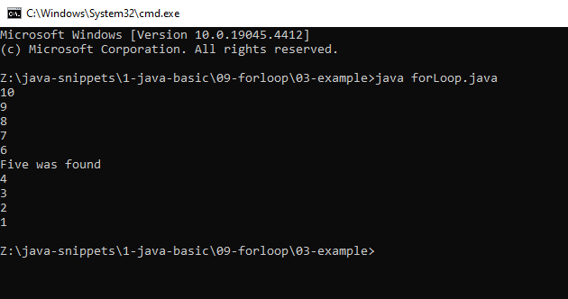


## 10-while-loop

### foorloop.java

```java

public class whileloop{
	
	public static void main(String[]args){
		
		int a=20;
		
		while(a>=10){
			
			System.out.println(a);
			a--;
			
		}
		
	}
	
}

//this is called while loop


```


### Output


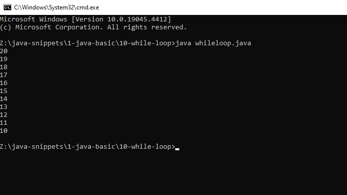

## 11-do-while

### dowhile.java

```java
public class dowhile{
	
	public static void main(String[]args){
		
		int a=0;
		
		do{
			
			System.out.println(a);
		a++;
		}while(a==0);
		
	}
	
}

//even though the condition is false the do while loop runs once
//because it first does the code inside do statement than it checks the while condidtion.

```

### Output


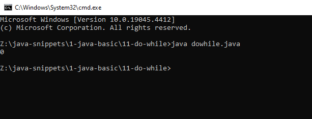

## 12-break-statement

### breakSt.java

```java
public class breakSt{
	
	public static void main(String[]args){
		
		for(int s=0;s<=100;s++){
			
			if(s==50){
				
				break;
				
			}
			
			System.out.println(s);
			
		}
		
	}
	
}

//The break statement stoped the at 50.It won't continue.

```

### Output

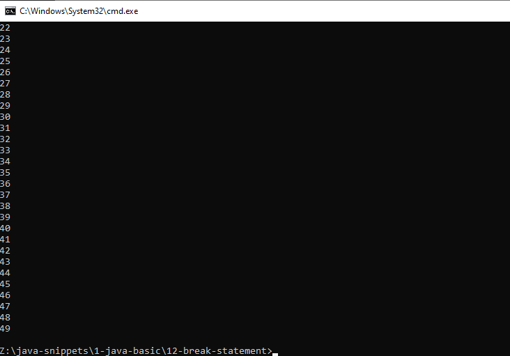

## 13-continue

### continueSt.java

```java
public class continueSt{
	
	public static void main(String[]args){
		
	  int f;
	  
	  for(f=0;f<=100;f++){
		  
		  if(f==50){
			  
			  continue;
			  
		  }
		  
		  System.out.println(f);
		  
	  }
	  
		
	}
	
}

//The continue jumps only one itaration.
//This will only skip the 50 then it will continue.

```

### Output

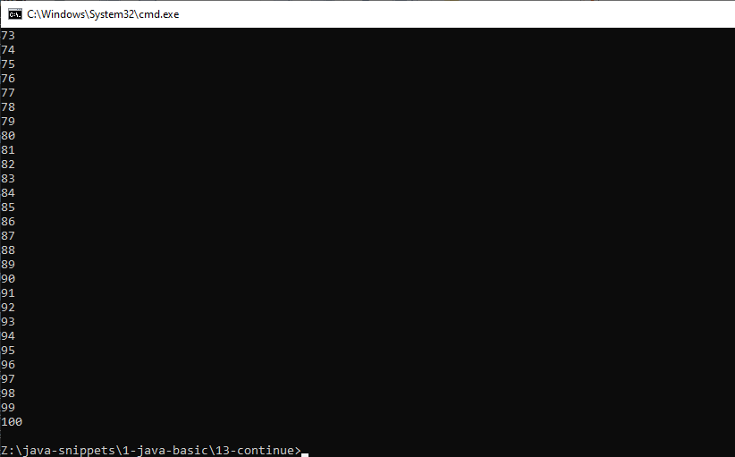

## 14-class

### classDe.java

```java
public class classDe{
	
	public static void main(String[]args){

     int a=5;
     int b=5;
     String c="Hello ";
     String d="World";

     System.out.println(a+b);
     System.out.println(c+d);

	}
	
	
}

//classDe is a class in java

```

### Output

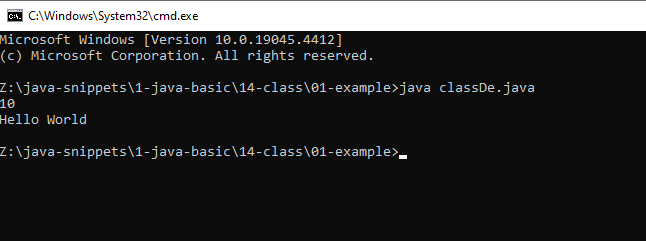


### Area.java

```java
public class Area {
	
	void call(int x){
		
		int square=x*x;
		System.out.println("The Square "+square);
		
	}
	
	public static void main(String[]args){
		
		Area ar=new Area();
		ar.call(12);
		
	}
	
}

```

### Output

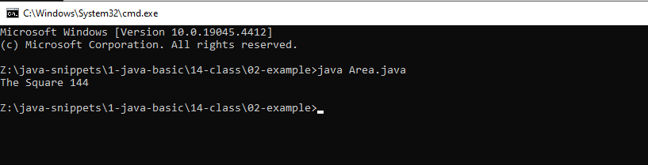

## 15-overloaded-methods

### book.java

```java

class book{
	
	void displayInfo(String bittle,String author){
		
		System.out.println("The book "+bittle+" is written by "+author);
		
	}
	
	void displayInfo(String bittle){
		
		System.out.println("The book is "+bittle);
		
	}
	
	void displayInfo(String bittle,int nprice){
		
		System.out.println("The book is "+bittle+" is Rs "+nprice);
		
		
	}
	
	
	public static void main(String[]args){
		
		book b=new book();
		b.displayInfo("C++ Easy Guide","Kuna");
		b.displayInfo("C++ Easy Guide");
		b.displayInfo("C++ Easy Guide",1000);
		
		
	}
	
}

//This is called overloaded methods.
//The variable name in the parameter do not matter.Only the number and the type of the parameters matter.

```

### Output

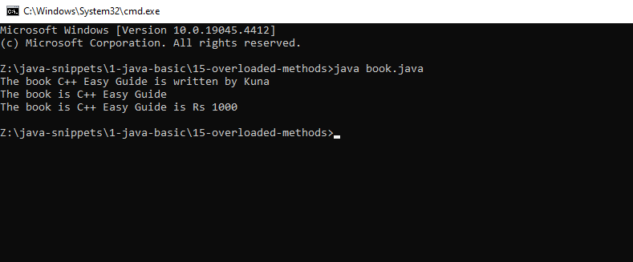

## 16-access-specifies

### CountInstances.java

```java
public class CountInstances{

   private static int numInstances=0;
   
   protected static int getNumInstances(){
	   
	   return numInstances;
	   
   }
   
   private static void addInstance(){
	   
	   numInstances++;
	   
   }
   
   CountInstances(){
	   
	   CountInstances.addInstance();
	   
	   
   }
   
   public static void main(String[]args){
	   
	   System.out.println("String with "+CountInstances.getNumInstances()+" Instances");
	   
	   for(int i=0;i<10;i++){
		   
		   new CountInstances();
		   
		   System.out.println("Created "+CountInstances.getNumInstances()+" instacnces");
		   
	   }
	   
   }

	
	
}


```

### Output

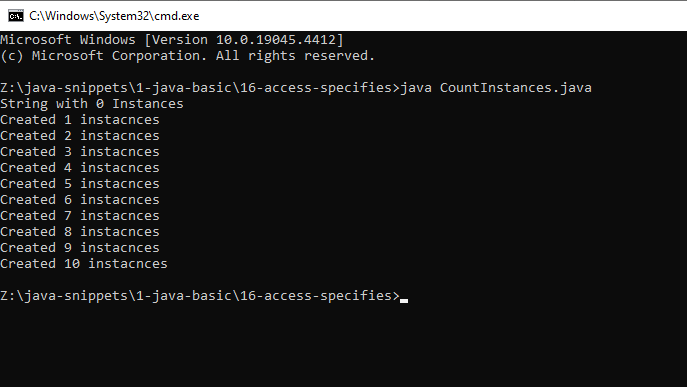

## 17-cmd-arguments

### arg.java

```java
public class arg{
	
	public static void main(String[]args){
		
		System.out.println("My name is"+args[0]);
		
	}
	
}

//This program arguments in the cmd
//That'y why we put the args in this main method.
```

### Output

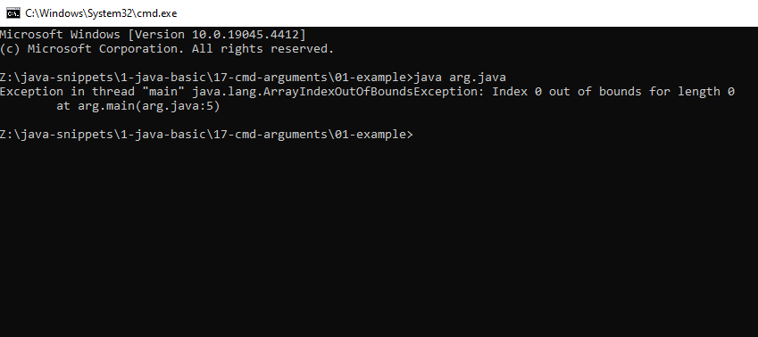

### fullName.java

```java

public class fullName{
	
	public static void main(String[]args){
	
     System.out.println(args[0]+" "+args[1]);	
		
	}
	
}

//This is takes Two Arguments

```

### Output

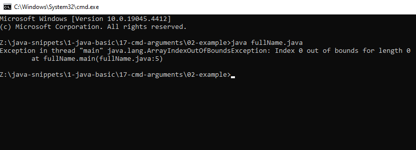


## 17-cmd-arguments

### Person.java

```java
public class Person{
	
	String name;
	int age;
	
	Person(String n,int a){
		
		name=n;
		age=a;
		
	}
	void PrintPerson(){
		
		System.out.println("My name is "+name);
		System.out.println("My age is "+age);
		
	}
	
	
	public static void main(String[]args){
		
		Person p=new Person("Kuna",25);
		p.PrintPerson();
		System.out.println("-------------");
		
        Person p2=new Person("Joker",36);
		p2.PrintPerson();
		System.out.println("--------------");
	    
		
	}
}

//This is constructors


```

### Output

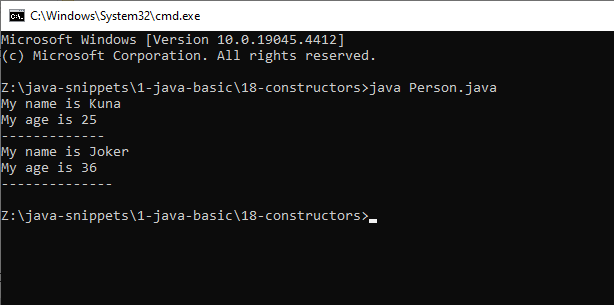


## 19-overloaded-constructor

### Student.java

```java
public class Student{
	
	String name;
	int age;
	int id;
	
	Student(String n, int a){
		
		name=n;
		age=a;
		
	}
	
	Student(String n,int a,int i){
		
		name=n;
		age=a;
		id=i;
		
	}

    void Printer(){
	
		System.out.println("The Student name is "+name);
		System.out.println("The Stdeunt age is "+age);
		System.out.println("The Student id "+id);
	
		
	}	
	
	
	public static void main(String[]args){
		 

		 Student s1=new Student("Kuna",21);
		 Student s2=new Student("Joker",23,3698);
		 s1.Printer();
		 
		 System.out.println("------------------------");
		 
		 s2.Printer();
      		
	}
	
	
}


```

### Output

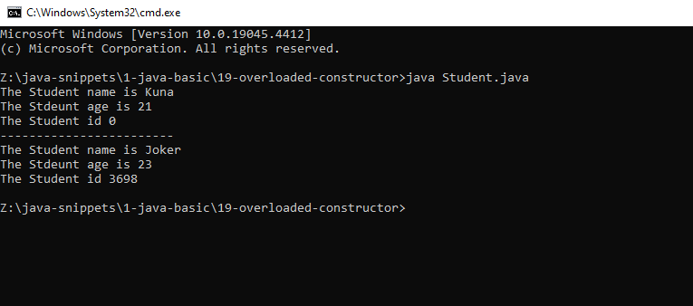

## 20-inheritance

### GetData.java

```java
public class GetData extends Person{ 
	
	public static void main(String[]args){
		
		GetData g1=new GetData();
		g1.PrintData();
		
	}
	
}

//This class is dervied form the Person class.
//if we dervie a class we can access all data in the base class.

```

### Output

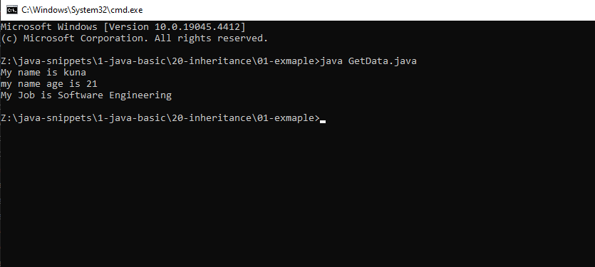

### Get.java

```java
class data{
	
    String name="Kuna";
	int age=15;
	
	void SystemPrint(){
		
		System.out.println("My name is "+name);
		System.out.println("My name is age "+age);
		
	}
	
}

//Data is base class

public class Get extends data {
	
	
	public static void main(String[]Args){
		
     Get p=new Get();
     p.SystemPrint();	
		
    }
	
	
}

//Get is the deveried class.

//in the pervious example we saw that the base class in a sperate file and the dervied in the sperate file.
//but in this example all are in one file.
```

### Output

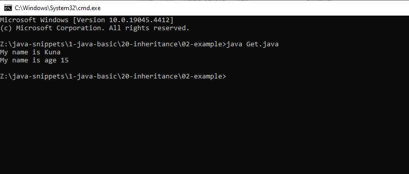

### Detail.java

```java
class Detail extends Personal{
	
	void show(){
		
		System.out.println("Lastname:"+lname);
		System.out.println("Address: "+address);
		System.out.println("Age:"+age);
		
	}
	
	public static void main(String[]args){
		
		Detail det=new Detail();
		det.showDat();
		det.show();
		
	}
	
}

//This class is derving from the personal class.


```

### Output

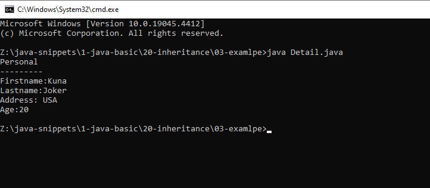

## 21-overrinding-methods

### PrintClass.java

```java
class PrintClass{
	
	int x=0;
	int y=1;
	
	void printMe(){
		
		System.out.println("X is "+"Y is "+y);
		System.out.println("I am an instance of the class"+this.getClass().getName());
	}
	
	
}

```

### Output


### PrintSubClass.java

```java
class PrintSubClass extends PrintClass{

int z=3;

void printMe(){

System.out.println("I am an instance of the "+getClass().getName());

}

public static void main(String[]args){

	PrintSubClass obj=new PrintSubClass();
	obj.printMe();

}

}

//The drived calss has higher presistence.

```

### Output

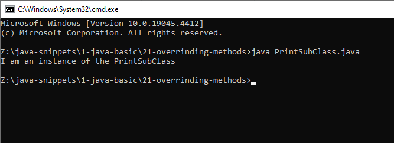

## 22-overriding-constroctor

### namePoint.java

```java

import java.awt.Point;

class namePoint extends Point{

  String name;

  namePoint(int x,int y,String name){

   super(x,y);
   this.name=name;

  }

  public static void main(String[]args){

  	namePoint np=new namePoint(5,5,"Guna");
  	System.out.println(np.x);
  	System.out.println(np.y);
  	System.out.println("The name is "+np.name);
  }

}
```

### Output

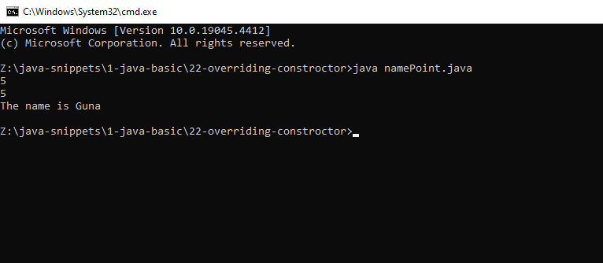

## 23-array

### arrayTest.java

```java

class arrayTest{
	
	String[] firstName={"Guna","Joker","hacker","doer"};
	String[] lastName=new String[firstName.length];
	
	void printNames(){
		
		int i=0;
		
		System.out.println(firstName[i]+" "+lastName[i]);
		i++;
		
		System.out.println(firstName[i]+" "+lastName[i]);
		i++;
		
		System.out.println(firstName[i]+" "+lastName[i]);
		i++;
		
		System.out.println(firstName[i]+" "+lastName[i]);
		i++;
		
		
	}
	
	public static void main(String[]args){
		
		arrayTest as=new arrayTest();
		as.printNames();
		System.out.println("-----------");
		as.lastName[0]="rakulan";
		as.lastName[1]="rakulan";
		as.lastName[2]="rakulan";
		as.lastName[3]="rakulan";
		
		as.printNames();
		
	}
	
}

```

### Output

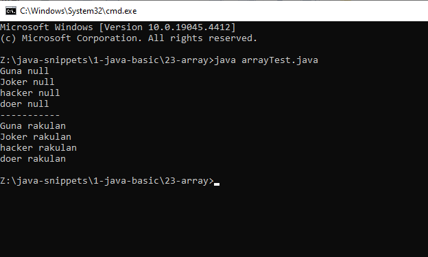

## 24-create-files

### creatrFile.java

```java

import java.io.File;

class createFile{
	
	public static void main(String[]args){

     File f=new File("D:/kuna.txt");
 
     if(f.mkdir()){
		 
		 System.out.println("Created a file");
		 
	 } else{
		 
		  System.out.println("Unable to create a file");
		 
	 }
		
	}
	
}

//This program is used to create folder.

```

### Output

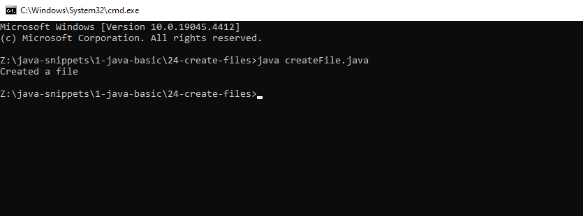
