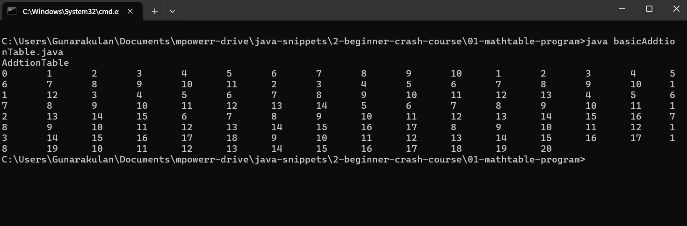
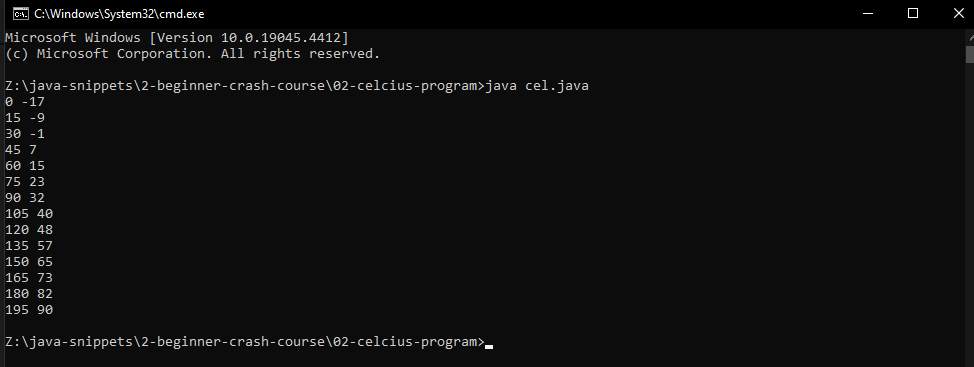
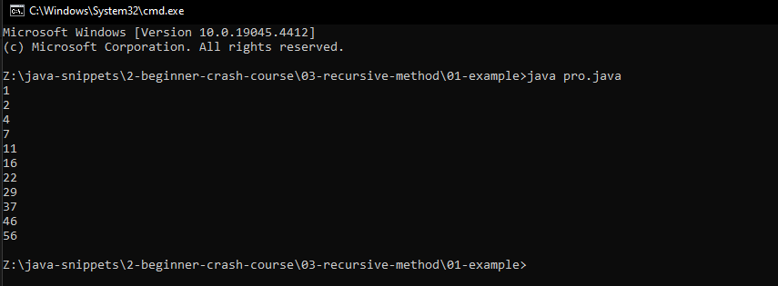
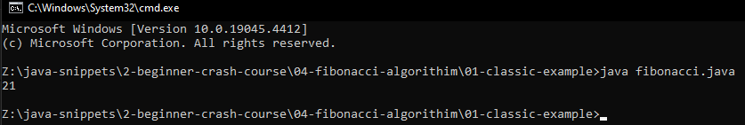
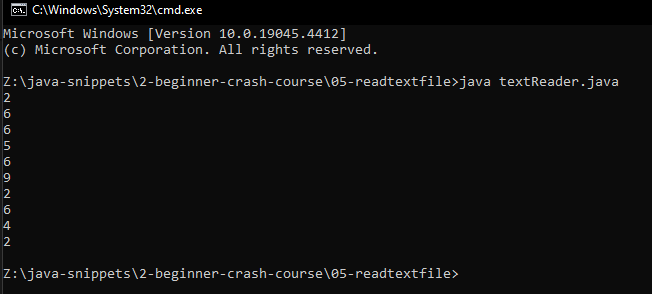
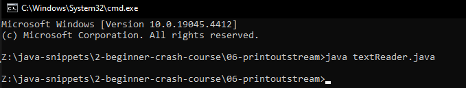

# Beginner Crash Course

## 01-mathtable-program

### hello.java

```java

public class basicAddtionTable{

	public static void main(String[]args){

		System.out.println("AddtionTable");

		for(int i=0;i<=10;i++){

			for(int j=0;j<=10;j++){

				System.out.print((i+j)+"\t");//we can also use * to create multipulication table.

			}

			System.out.print("");
		}
		
	}

}

```

### Output




## 02-celcius-program

### cel.java

```java
public class cel{

	public static void main(String[]args){

		int far,cel;
		int lower,upper,step;
		lower=0;
		upper=200;
		step=15;
		far=lower;

		while(far<=upper){

			cel = 5 * (far-32) / 9;
			System.out.print(far);
			System.out.print(" ");
			System.out.println(cel);
			far=far+step;

		}

	}

}


```


### Output




## 03-recursive-method

### pro.java

```java
public class pro{

	public static void main(String[]agrs){

		//Method usages
		int o=0;
		long re=0;

		for(o=0;o<=10;o++){

		 re=fact(o);

		System.out.println(re);

		}

		
	}

	//Method exmaple
	static long fact(long n){

		int i=0;
		long result=1;

		for(int a=0;a<=n;a++){

			result+=a;
		}

		return result; 
	}
}


```


### Output




## 04-fibonacci-algorithim

### fibonacci.java

```java
 //This is fibonacci algorithm.
public class fibonacci{

	public static void main(String[]args){

		System.out.println(fib(8));

	}

	public static int fib(int n){

		if(n==0){

			return 0;

		}else if(n==1){

			return 1;

		}else{

			return fib(n-1) + fib(n-2);
		}

	} 

}


```


### Output




## 05-readtextfile

### textReader.java

```java
//This is program reads data from a text file and display them to the console.
//We take the text file and put into an array then we print them.

import java.io.*; 

public class textReader{


	public static void main(String[]args){
		int[] arr=new int[10];
		int i=0;

		try{

			FileInputStream fstream = new FileInputStream("data.txt");
			DataInputStream in=new DataInputStream(fstream);
			BufferedReader br=new BufferedReader(new InputStreamReader(in));
			String strLine;

			while((strLine=br.readLine()) !=null){

				arr[i]=Integer.parseInt(strLine);
				i++;
			}

			in.close();
		}catch(Exception e){

			System.err.println("ERROR: "+ e.getMessage());
		}

		printArry(arr);
	}

	public static void printArry(int x[]){

		for(int a=0;a < 10;a++){

			System.out.println(x[a]);

		}

	}

}


```


### Output




## 06-printoutstream

### textReader.java

```java
//This is program reads data from a text file and display them to the console.
//We take the text file and put into an array then we print them.

import java.io.*; 
import java.util.*;


public class textReader{


	public static void main(String[]args){
		int[] arr=new int[10];
		
		readFile(arr);
		Arrays.sort(arr);//we sort the array.
		writeArray(arr);
	}

	public static void writeArray(int x[]){

		try{

			FileOutputStream fo=new FileOutputStream("sort.txt");
			PrintStream myObj=new PrintStream(fo);

			for(int a=0;a<10;a++){

				myObj.println(x[a]);
			}

		}catch(IOException e){

			System.out.println(e);
			System.exit(1);

		}

	}

	public static void readFile(int x[]){

		int i=0;

		try{

			FileInputStream fstream = new FileInputStream("data.txt");
			DataInputStream in=new DataInputStream(fstream);
			BufferedReader br=new BufferedReader(new InputStreamReader(in));
			String strLine;

			while((strLine=br.readLine()) !=null){

				x[i]=Integer.parseInt(strLine);
				i++;
			}

			in.close();
		}catch(Exception e){

			System.err.println("ERROR: "+ e.getMessage());
		}

	}

}


```


### Output





